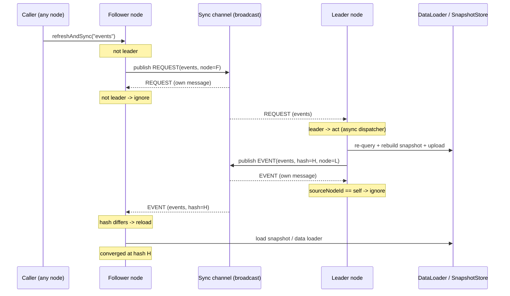

# Cluster Refresh Request Propagation

## Context

Andersoni runs the same cache on many nodes. One node is elected leader; the
rest are followers. The leader owns the *authoritative refresh*: it re-queries
the data source, rebuilds the snapshot, optionally uploads it to the snapshot
store, and broadcasts a notification so followers reload.

`refreshAndSync(catalogName)` is the public entry point application code calls
to force a refresh. The problem it solves: **any node can receive that call**
(it is triggered by an HTTP admin endpoint, a scheduled job, a business event,
etc.), but only the leader is allowed to perform the authoritative refresh.

Before this use case, a follower that received `refreshAndSync` did nothing at
all (an early `if (!isLeader()) return;` guard). The refresh was silently
dropped and never propagated to the cluster. This document describes how a
follower now delegates the refresh to the leader without ever creating a
propagation loop.

## Problem: why the naive fix loops

The synchronization channel (Kafka topic, HTTP peer broadcast, etc.) is a
*broadcast*: every node receives every message, including its own. If a
follower simply re-published the same kind of message it listens to, and
followers reacted to it by refreshing-and-republishing, the cluster would emit
an unbounded storm of messages. The design must be provably acyclic.

## Solution: two message kinds on one channel

A single record type `RefreshEvent` now carries a `RefreshKind` discriminator:

- `EVENT` (the default) — a **result**: "catalog X was refreshed to hash H,
  reload." Published by the leader, consumed by followers, which reload and
  emit nothing.
- `REQUEST` — a **command**: "cluster, please refresh catalog X." Published by
  a non-leader node that received `refreshAndSync`. **Only the leader acts on
  it**; followers ignore it, so it is never re-emitted.

### Why no loop can form

The propagation graph is a DAG:

```
REQUEST --(only the leader acts)--> authoritative refresh --> EVENT --(followers)--> reload --> (nothing)
```

No message kind, when handled, produces another message of the **same** kind:

- A `REQUEST` handled by the leader produces an `EVENT` (different kind).
- A `REQUEST` handled by a follower produces nothing (ignored).
- An `EVENT` handled by a follower produces nothing (reload only).
- An `EVENT` handled by its own publisher is dropped by the self-node check.

Therefore the number of messages triggered by one `refreshAndSync` is bounded
and the system always quiesces.

## Business rules

1. The authoritative refresh (re-query + snapshot rebuild + snapshot-store
   upload + `EVENT` broadcast) runs **only on the leader**.
2. `refreshAndSync` on the **leader** performs the authoritative refresh
   directly (no request round-trip).
3. `refreshAndSync` on a **follower** publishes a `REQUEST` and returns without
   touching local state. It converges later through the leader's `EVENT`.
4. `refreshAndSync` on a follower **with no sync strategy configured** is a
   safe no-op (there is no channel to reach the leader).
5. A received `REQUEST` is acted upon **only if the receiver is the leader**;
   otherwise it is ignored.
6. A received `EVENT` is ignored if it originated from this node or if the
   local catalog is already at the event's hash; otherwise the catalog reloads
   (snapshot store first, then the data loader).
7. Request handling on the leader runs through the async refresh dispatcher, so
   the transport's consumer thread is never blocked and refreshes for the same
   catalog coalesce.

## Domain events / messages

`RefreshEvent` (broadcast on the sync channel):

| Field          | Type          | EVENT                     | REQUEST            |
|----------------|---------------|---------------------------|--------------------|
| `catalogName`  | `String`      | catalog name              | catalog name       |
| `sourceNodeId` | `String`      | publishing node           | requesting node    |
| `version`      | `long`        | snapshot version          | `0`                |
| `hash`         | `String`      | snapshot content hash     | `""` (empty)       |
| `timestamp`    | `Instant`     | refresh instant           | request instant    |
| `kind`         | `RefreshKind` | `EVENT`                   | `REQUEST`          |

Wire format (`RefreshEventCodec`, JSON): the `kind` field is optional on read
and defaults to `EVENT` when absent or unrecognized, so nodes running an older
version (which never emitted `kind`) remain interoperable.

## Sequence diagram



## API contracts

Core (unchanged signatures):

- `void Andersoni.refreshAndSync(String catalogName)` — behavior extended per
  the business rules above. Backward compatible for callers.
- `void SyncStrategy.publish(RefreshEvent event)` — now also carries `REQUEST`
  messages. Transports that cannot represent a command must drop requests
  safely (see Constraints).

New / changed types in `org.waabox.andersoni.sync`:

- `enum RefreshKind { EVENT, REQUEST }`
- `record RefreshEvent(... , RefreshKind kind)`:
  - canonical constructor validates all fields non-null;
  - `RefreshEvent(catalogName, sourceNodeId, version, hash, timestamp)` —
    convenience constructor defaulting to `EVENT` (keeps existing call sites);
  - `static RefreshEvent request(catalogName, sourceNodeId, timestamp)`;
  - `boolean isRequest()`.

## Constraints

- **Transport must broadcast to reach the leader.** Kafka, Spring Kafka and
  HTTP peer-to-peer broadcast every message to every node, so the request
  reaches the leader. These transports serialize through `RefreshEventCodec`
  and preserve `kind`.
- **DB polling does not support requests.** `DbPollingSyncStrategy` is a
  *state* channel: it keeps the latest hash per catalog in a table and detects
  changes by hash diff. A `REQUEST` carries no hash and has no leader
  back-channel, so writing it would corrupt change detection. `publish` ignores
  requests; with DB polling a follower's `refreshAndSync` is a safe no-op.
- **Request storms are possible but bounded.** N followers calling
  `refreshAndSync` concurrently produce N requests and up to N leader refreshes.
  This never loops; redundant reloads are further damped by the receiver-side
  hash equality check. No debounce/coalescing of requests is implemented.

## Tradeoffs and rejected alternatives

- **Chosen: `kind` discriminator on the existing broadcast channel, reusing
  `publish`/`subscribe`.** Smallest blast radius — the four transports are
  untouched except the shared codec gains one field; all discrimination logic
  lives in the core listener where the leader check already exists.
- **Rejected: separate command topic/channel.** Cleaner conceptual separation
  but doubles the transport surface (topic config, consumer thread, subscribe)
  across every sync module for a single command type.
- **Rejected: new `SyncStrategy` methods (`publishRequest`, second listener).**
  More explicit and type-safe but forces changes to all four transport
  implementations plus Spring auto-configuration.
- **Rejected: point-to-point message to the leader's address.** Only HTTP could
  target a node; Kafka and DB cannot address a single node, breaking the
  pluggable transport abstraction.

## Open questions

- Should repeated requests for the same catalog within a short window be
  debounced on the leader (coalesce a request storm into one refresh)?
- Should a request time-to-live / staleness guard be added so a request queued
  during a leadership change is not acted upon by a new leader much later?
- Do we want a first-class command channel for DB polling deployments, or is
  the documented no-op acceptable for that transport indefinitely?
