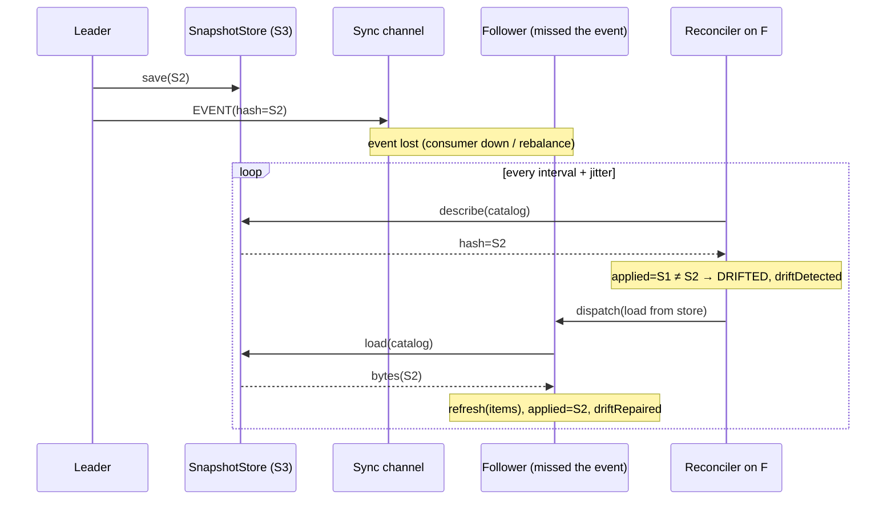
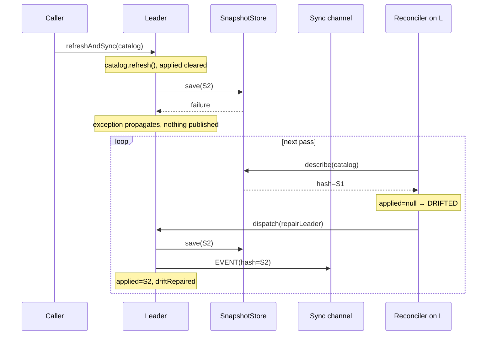

# Cluster Snapshot Reconciliation (Anti-Entropy)

## Context

Andersoni runs the same catalogs on many nodes. One node is the leader and
owns the *authoritative refresh*: it re-queries the `DataLoader`, rebuilds the
snapshot, uploads it to the `SnapshotStore` and broadcasts a `RefreshEvent`
over the `SyncStrategy`. Followers reload when they receive the event (see
`cluster-refresh-request-propagation.md`).

That sync channel is fire-and-forget. Before this use case, nothing ever
checked whether a node had actually converged, so a node could silently serve
a different snapshot than the rest of the cluster until an operator forced a
manual refresh. Five concrete divergence paths existed:

1. A missed `EVENT` was lost forever (Kafka consumer down, rebalancing, or
   restarting during the broadcast; HTTP peer unreachable).
2. A failed reload on the follower (`SnapshotStore` or `DataLoader` transient
   error) was never retried.
3. Convergence was never verified after a reload.
4. A leader change re-announced nothing.
5. A failed snapshot save on the leader aborted before the event was
   published, leaving the leader ahead of every follower.

This use case makes the cluster self-healing: the **snapshot store is the
authoritative state**, every node periodically compares itself against it and
repairs drift automatically, and a promoted leader re-establishes truth from
the source. Design spec:
`docs/superpowers/specs/2026-09-11-snapshot-reconciliation-design.md`.

## Business rules

### Reconciliation loop

1. Reconciliation runs only when a `SnapshotStore` is configured **and** the
   `ReconciliationPolicy` is enabled. With a store and no explicit policy it is
   **on by default**, every 30 seconds (`ReconciliationPolicy.defaultPolicy()`);
   `ReconciliationPolicy.disabled()` turns it off. Each pass is scheduled at
   the interval plus a random jitter of up to 20 % so nodes do not hit the
   store in lockstep.
2. Only catalogs with a `SnapshotSerializer` are reconciled. Catalogs without
   one report `SyncState.UNKNOWN` and keep the previous behavior.
3. Each node tracks, per catalog, the **applied store hash**: the hash of the
   store object it last loaded or wrote (`SnapshotStoreBridge`). It is set on
   every load from the store and on every successful save, and cleared
   (`null`, meaning "must reconcile") whenever the local state changed from a
   source other than the store: a leader's local refresh before its save
   attempt, a follower's `DataLoader` fallback, a local `refresh(name)`, or a
   failed bootstrap.
4. Drift is always detected by comparing the store's hash (obtained through
   `SnapshotStore.describe`, metadata only) against the **applied** hash, never
   against the in-memory snapshot hash. This keeps a serializer whose round
   trip is not byte-stable from causing a reload on every pass.
5. Decision table, evaluated per catalog on every pass:

   | Role     | Store        | Condition                              | Outcome                                   |
   |----------|--------------|----------------------------------------|-------------------------------------------|
   | Follower | empty        | —                                      | in sync (leader has not uploaded yet)     |
   | Follower | hash `H`     | `H == applied`                         | in sync                                   |
   | Follower | hash `H`     | otherwise                              | drift → reload from the store             |
   | Leader   | empty or `H` | `applied != null && H == applied`      | in sync                                   |
   | Leader   | empty or `H` | otherwise                              | drift → re-save and re-publish an `EVENT` |

6. A follower repair loads from the store and **never** falls back to the
   `DataLoader`: the goal is convergence to the authoritative state, not a
   fresh re-query. A successful repair also removes the catalog from
   `failedCatalogs`, so a follower whose bootstrap failed recovers as soon as
   the store has a snapshot.
7. A leader whose catalog is in `failedCatalogs` has nothing to publish; it
   stays `DRIFTED` and waits for its bootstrap path.
8. Repairs run through the `AsyncRefreshDispatcher`, so they are serialized
   per catalog with sync-event reloads and coalesced. The reconciler keeps no
   in-flight marker of its own: a dropped dispatch would never clear it.
9. `SnapshotStoreBridge.save` is serialized per catalog. Two writers exist on
   the leader (`refreshAndSync` on the application thread and the repair on a
   dispatcher thread); the lock guarantees the last write is always the newest
   snapshot.
10. A failed step (`describe`, load, save, publish) is reported through
    `AndersoniMetrics.reconcileFailed` and simply retried on the next pass;
    the loop is the retry mechanism. A repair failure logs its stack trace only
    on the first failure of a consecutive run.
11. `Andersoni.reconcile()` runs a pass as soon as possible on the reconciler
    thread and returns. It never queries the `DataLoader` and is the
    operational replacement for a manual refresh. It throws
    `IllegalStateException` after `stop()` and is a no-op when reconciliation
    is inactive.

### Leader promotion

12. When a node is promoted to leader, `Andersoni` dispatches an
    **authoritative refresh** (`refreshAndSync`: re-query, save, publish) for
    every catalog. It runs whether or not a snapshot store is configured. A
    promoted follower's in-memory snapshot may be older than the one the
    previous leader uploaded just before dying; re-querying the source is the
    only way to avoid pushing stale data over the store.
13. Every catalog is marked "promotion refresh pending" before dispatching. If
    a leader repair queued a moment earlier wins the dispatcher (the pass saw
    `isLeader()` before the notification arrived, so the promotion dispatch was
    coalesced away), that repair performs the source refresh instead of
    re-saving. Whichever task runs first clears the mark.
14. A promotion refresh that finds the node demoted again does nothing (no
    `REQUEST` is published, `failedCatalogs` is untouched). A failed promotion
    refresh is logged and reported (`metrics.refreshFailed`); the
    reconciliation loop remains the fallback.

### Observability

15. `AndersoniStatus.CatalogStatus` carries `syncState` (`IN_SYNC`,
    `DRIFTED`, `UNKNOWN`) and `lastReconciledAt`; `available` is `false` for a
    catalog in `failedCatalogs`. `AndersoniStatus.inSync()` is `false` only
    when some catalog is `DRIFTED`.
16. Metrics: `driftDetected(catalog)` once per drifted catalog per pass,
    `driftRepaired(catalog)` once per successful repair,
    `reconcileFailed(catalog, cause)`. Datadog emits them as counters
    `reconcile.drift_detected`, `reconcile.drift_repaired`, `reconcile.failed`
    and a gauge `catalog.in_sync` (1/0 per catalog; the alerting signal).

## Domain events / messages

No new wire message. The leader's repair publishes the existing
`RefreshEvent` of kind `EVENT` (never a `REQUEST`), so the propagation DAG
`REQUEST → EVENT → reload` stays acyclic. A reconciliation pass on a follower
publishes nothing.

Internal signals, per catalog:

| Signal                      | Producer                          | Consumer                        |
|-----------------------------|-----------------------------------|---------------------------------|
| applied store hash          | `SnapshotStoreBridge` load/save   | `SnapshotReconciler`            |
| `SyncState`, `lastReconciledAt` | `SnapshotReconciler`          | `Andersoni.status()`            |
| promotion refresh pending   | `Andersoni` (promotion listener)  | `Andersoni.repairLeader`        |
| `driftDetected` / `driftRepaired` / `reconcileFailed` | `SnapshotReconciler` | `AndersoniMetrics` |

## Sequence diagrams

### Follower repair after a missed event



### Leader repair after a failed save



### Leader promotion

```mermaid
sequenceDiagram
    participant E as LeaderElection
    participant N as Promoted node
    participant D as AsyncRefreshDispatcher
    participant Src as DataLoader
    participant S as SnapshotStore
    participant Bus as Sync channel

    E->>N: onLeaderChange(true)
    Note over N: mark every catalog "promotion refresh pending"
    N->>D: dispatch(refreshAndSync) per catalog
    D->>N: promotedLeaderRefresh(catalog)
    Note over N: clear mark; still leader?
    N->>Src: load()
    N->>S: save(fresh)
    N->>Bus: EVENT(hash=fresh)
    Note over N: applied=fresh; failedCatalogs.remove(catalog)
```

## API contracts

Core (`org.waabox.andersoni`):

- `ReconciliationPolicy.of(Duration interval)`, `disabled()`,
  `defaultPolicy()` (30 s); `enabled()`, `interval()`.
- `Andersoni.Builder.reconciliation(ReconciliationPolicy)` — default
  `defaultPolicy()`.
- `void Andersoni.reconcile()` — on-demand pass, see rule 11.
- `enum SyncState { IN_SYNC, DRIFTED, UNKNOWN }`.
- `AndersoniStatus.CatalogStatus(..., SyncState syncState,
  Optional<Instant> lastReconciledAt)`; `boolean AndersoniStatus.inSync()`.
- `AndersoniMetrics` defaults: `driftDetected(String)`,
  `driftRepaired(String)`, `reconcileFailed(String, Throwable)`.

Snapshot store (`org.waabox.andersoni.snapshot`):

- `record SnapshotMetadata(catalogName, hash, version, createdAt)` with
  `static of(SerializedSnapshot)`.
- `default Optional<SnapshotMetadata> SnapshotStore.describe(String catalogName)`
  — delegates to `load` (correct, expensive); `S3SnapshotStore` overrides
  with `HeadObject`, `FileSystemSnapshotStore` reads only the file header.
  `Optional.empty()` means "no snapshot", like `load`.

Spring Boot starter: `andersoni.reconciliation.enabled` (default `true`),
`andersoni.reconciliation.interval` (default `30s`).

Package-private collaborators: `SnapshotStoreBridge` (store access and applied
hash), `SnapshotReconciler` (loop), `AsyncRefreshDispatcher` (extracted from
`Andersoni`).

## Constraints

- The store is the authority. A follower's local `refresh(name)` is
  overwritten by the store on the next pass; on the leader it is picked up,
  re-saved and re-published within one interval.
- Cost: one `describe` per catalog per node per interval. On S3 that is a
  `HeadObject`; a custom store that does not override `describe` pays a full
  download instead — override it.
- Behavior change on upgrade: deployments with a store start reconciling every
  30 s automatically. Opt out with `disabled()` or
  `andersoni.reconciliation.enabled=false`.
- `CatalogStatus` gained two components; code constructing it directly must
  adapt (only the library did).
- `SnapshotStoreBridge.save` holds a per-catalog `synchronized` monitor across
  the upload; on Java 21 that pins the virtual-thread carrier for the duration
  of a leader repair's upload. Repairs are rare and short.
- `KafkaSyncStrategy.publish` can block `refreshAndSync` for up to
  `max.block.ms` when the producer never fetched metadata and the broker is
  down (pre-existing). The cluster ITs warm the producer up before stopping
  Kafka.

## Integration tests (`andersoni-cluster-it`)

- `ClusterReconciliationIT`: three nodes on a shared filesystem store, Kafka
  stopped, leader refresh → all converge through the store and report
  `IN_SYNC`; versions stay stable afterwards (no repair loop).
- `ClusterSelfHealingIT` (fault injection through the node's HTTP endpoints
  `/leader`, `/fault/store`, `/fault/sync`, `/reconcile`, `LOADER_MODE=fail`):
  leader dies after a refresh the followers missed and a promoted follower
  converges the cluster on fresh data; leader save fails and is re-published
  once the store recovers; one follower isolated from Kafka converges through
  the store while the other converges through Kafka; a follower whose
  bootstrap failed recovers once the leader uploads.

## Tradeoffs and rejected alternatives

- **Chosen: store-based reconciliation (followers pull, leader pushes).**
  Independent of the sync channel's health, closes all five divergence paths,
  and needs only a cheap metadata call per cycle.
- **Rejected: leader heartbeat over the sync channel.** Reuses the existing
  "hash differs → reload" logic and covers serializer-less catalogs, but
  depends on the very channel that fails and cannot repair a stale store.
- **Rejected: comparing against the in-memory snapshot hash.** Breaks under a
  serializer whose round trip is not byte-stable (reload loop every cycle).
- **Rejected: retry with backoff inside `refreshFromEvent`.** Addresses one
  path only; the loop already retries.
- **Rejected: Kafka `auto.offset.reset=earliest` / durable offsets.** Replays
  after a restart but not after a lost message, a dead consumer or a failed
  reload.
- **Rejected: an in-flight repair marker in the reconciler.** The dispatcher
  already coalesces; a marker would wedge whenever a dispatch is dropped.
- **Rejected: a reconciliation pass on promotion.** A promoted follower whose
  snapshot is older than the store's would overwrite the store with stale
  data. Replaced by the authoritative refresh (rules 12–14).

## Open questions

- Two overlapping leaders (lease handover) re-save once per interval until the
  lease settles. Gate the leader re-save by a minimum store-object age if a
  handover ever shows up as a burst of S3 traffic.
- When a leader repair delegates to the promotion refresh and that refresh
  fails, `syncState` reads `IN_SYNC` for one interval before the next pass
  corrects it. Make `promotedLeaderRefresh` report failure so the repair can
  throw.
- Swap the per-catalog monitor in `SnapshotStoreBridge.save` for a
  `ReentrantLock` to avoid carrier pinning on Java 21.
- Should the admin console expose `syncState` per node and a "reconcile now"
  action wired to `Andersoni.reconcile()`?
- `ClusterRefreshPropagationIT` and `ClusterReconciliationIT` duplicate the
  helpers that `ClusterHarness` now provides; migrate them when touched next.
