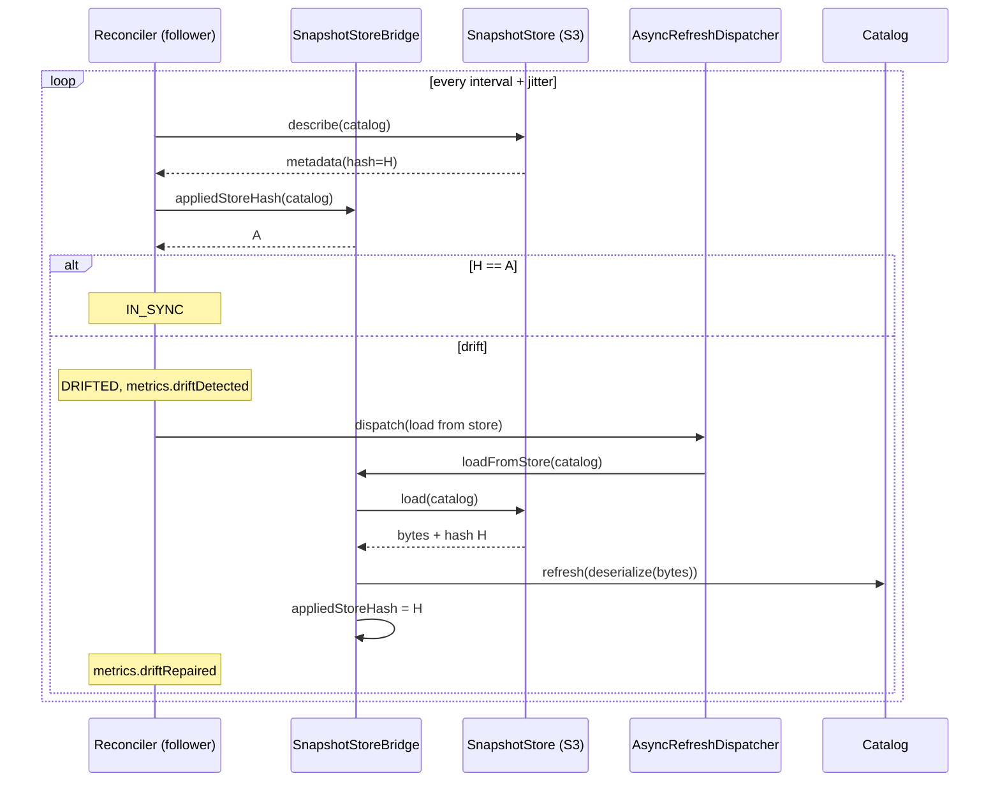

# Snapshot Reconciliation (Cluster Anti-Entropy) — Design Spec

## Context

Andersoni runs the same catalogs on many nodes. One node is the leader; it owns
the authoritative refresh (re-query the `DataLoader`, rebuild the snapshot,
upload it to the `SnapshotStore`, broadcast a `RefreshEvent` over the
`SyncStrategy`). Followers reload when they receive the event.

Production runs **Kafka sync + S3 snapshot store**, with refreshes triggered
only by business events (`refreshAndSync`), no periodic `refreshInterval`.
Operators regularly have to force a manual refresh because some nodes end up
serving a different snapshot than the rest of the cluster.

## Problem

The sync channel is a fire-and-forget *event* channel and nothing ever checks
whether a node actually converged. Five concrete divergence paths exist in the
current engine:

1. **A missed `EVENT` is lost forever.** Each Kafka consumer uses its own
   consumer group with `auto.offset.reset=latest`. A node that is restarting,
   rebalancing or down when the leader publishes never sees the event. The
   HTTP transport logs a warning on a failed peer POST and moves on. Nothing
   asks later "are you at hash H?".
2. **A failed reload is not retried.** If S3 or the `DataLoader` fails
   transiently inside `refreshFromEvent`, the error is logged and the node
   stays stale until the next event, which without `refreshInterval` may never
   come.
3. **Convergence is never verified after a reload.** If a follower falls back
   to the `DataLoader` and the source changed between the leader's query and
   the follower's, the follower ends up at a different hash and nobody knows.
4. **A leader change re-announces nothing.** The core never registers a
   `LeaderChangeListener`. A follower that missed the previous leader's last
   event stays stale indefinitely.
5. **A failed snapshot save on the leader aborts before publishing.**
   `saveSnapshotIfPossible` throws before `syncStrategy.publish`, leaving the
   leader ahead of every follower with no retry.

The common root cause is the absence of an **anti-entropy loop**: a periodic
check of each node against an authoritative state, with automatic repair.

## Solution

Add a periodic reconciliation loop on every node. The **snapshot store is the
authoritative state** of the cluster:

- **Followers pull**: compare the store's snapshot hash with the hash this node
  last applied; on mismatch, reload from the store.
- **The leader pushes**: compare the store's snapshot hash with what the leader
  last saved; on mismatch (or after a local refresh whose save failed),
  re-save and re-publish.
- **A newly promoted leader** runs an authoritative refresh of every catalog
  (re-query, save, publish), because its in-memory snapshot may be older
  than the store's.

Kafka remains the fast path. The store becomes the durable safety net, so
recovery no longer depends on the sync channel being healthy. The loop is also
the retry mechanism: a failed repair is simply attempted again next cycle.

Target: a divergent node repairs itself within one interval (default 30 s).

## Design

### 1. `SnapshotStore` contract: metadata without download

New record in `org.waabox.andersoni.snapshot`:

```java
public record SnapshotMetadata(
    String catalogName,
    String hash,
    long version,
    Instant createdAt) {

  public static SnapshotMetadata of(SerializedSnapshot snapshot) { ... }
}
```

New method on `SnapshotStore`:

```java
default Optional<SnapshotMetadata> describe(final String catalogName) {
  return load(catalogName).map(SnapshotMetadata::of);
}
```

- `Optional.empty()` means "no snapshot stored", exactly as in `load`.
- The default implementation is correct but downloads the whole snapshot.
  Custom stores keep compiling and working; built-in stores override it:
  - `S3SnapshotStore`: `HeadObject`, reading the same user-metadata headers
    `save` already writes (`hash`, `version`, `createdAt`). `NoSuchKey` maps
    to `Optional.empty()`.
  - `FileSystemSnapshotStore`: read the single-file header up to the blank
    line, or the legacy `snapshot.meta` file, without reading the data bytes.
- `describe` must never throw for "not found". Transport/IO failures propagate
  as runtime exceptions; the reconciler handles them.

### 2. `SnapshotStoreBridge` (package-private, `org.waabox.andersoni`)

`Andersoni.java` is ~1500 lines. The store-related private methods
(`tryLoadFromSnapshotStore`, `saveSnapshotIfPossible`, `sha256Hex`) move to a
new package-private class `SnapshotStoreBridge` so `Andersoni` and the
reconciler share one implementation. Behavior of those methods is unchanged.

The bridge also owns the one piece of state the design hinges on:

**`appliedStoreHash` per catalog** (`ConcurrentHashMap<String, String>`): the
hash of the store object this node last applied or wrote.

| Transition                                                 | Effect on `appliedStoreHash` |
|------------------------------------------------------------|------------------------------|
| Loaded from store (bootstrap, sync event, reconciliation)  | set to the loaded hash       |
| Saved to store successfully (leader refresh, leader reconcile, or the follower `DataLoader` fallback that saves) | set to the saved hash |
| Leader refreshed locally, *before* attempting the save     | cleared (`null`)             |
| Follower fell back to `DataLoader` (bootstrap or event)    | cleared (`null`)             |
| Catalog bootstrap failed (`failedCatalogs`)                | absent (`null`)              |

`null` always means "this node must reconcile".

**Why compare against the applied hash and not the in-memory snapshot hash.**
The in-memory hash is recomputed as `sha256(serializer.serialize(items))`
after deserializing. If the serializer's round trip is not byte-stable, the
in-memory hash of a node that loaded object H differs from H even though the
content is identical. Comparing the store hash against the in-memory hash
would then trigger a reload on every cycle, forever. Comparing against the
hash actually applied is immune to that, and also covers the leader that
bootstrapped from the store. The stored hash and the leader's in-memory hash
are produced by the same `serialize` call, so the leader's save path stays
self-consistent.

### 3. `SnapshotReconciler` (package-private, `org.waabox.andersoni`)

Own file. Dependencies, all injected by `Andersoni.start()`:
catalogs by name, `SnapshotStoreBridge`, `LeaderElectionStrategy`,
`AsyncRefreshDispatcher`, `AndersoniMetrics`, `ReconciliationPolicy`, the
`failedCatalogs` set, and a callback to run the leader's publish path.

**Scheduling.** Single-thread `ScheduledExecutorService` named
`andersoni-reconciler`, daemon. Each run is scheduled with the configured
interval plus a random jitter of up to 20% so N nodes do not hit the store in
lockstep. Stopped in `Andersoni.stop()`.

**Leader change.** `SnapshotReconciler` does not react to leadership changes;
`Andersoni` owns that. On `start()`, `Andersoni` registers
`leaderElection.onLeaderChange(isLeader -> { if (isLeader) refreshAllAsPromotedLeader(); })`,
which dispatches `refreshAndSync` for every registered catalog through the
`AsyncRefreshDispatcher` (serialized and coalesced per catalog). This runs
regardless of whether a snapshot store is configured. A promoted follower's
in-memory snapshot may be older than the one the previous leader uploaded
just before dying, so re-querying the source is the only way to avoid
publishing stale data over the store; the reconciliation pass remains the
fallback if the refresh itself fails.

**A pass** iterates every catalog that has a serializer (catalogs without one
are skipped and reported as `UNKNOWN`). For each catalog:

1. `metadata = store.describe(name)`. On exception: log at WARN,
   `metrics.reconcileFailed(name, e)`, continue with the next catalog.
2. `applied = bridge.appliedStoreHash(name)` (may be `null`).
3. Decide by role:

| Role     | Store state                       | Condition                          | Action                                            |
|----------|-----------------------------------|------------------------------------|---------------------------------------------------|
| Follower | empty                             | —                                  | nothing (leader has not uploaded yet)             |
| Follower | present, hash `H`                 | `H.equals(applied)`                | in sync                                           |
| Follower | present, hash `H`                 | otherwise                          | drift → dispatch **load from store**              |
| Leader   | empty or hash `H`                 | `applied != null && H.equals(applied)` | in sync                                       |
| Leader   | empty or hash `H`                 | otherwise                          | drift → dispatch **save to store + publish EVENT** |

4. Record the outcome per catalog: `syncState` (`IN_SYNC` / `DRIFTED`) and
   `lastReconciledAt = now`.

**Repair actions** go through `AsyncRefreshDispatcher.dispatch(name, task)`,
the same per-catalog serialization and coalescing used by sync events, so a
reconcile repair and an in-flight event reload never race on the same
catalog.

- *Load from store* (follower): `bridge.loadFromStore(name, catalog)`. On
  success: `appliedStoreHash = H`, remove `name` from `failedCatalogs` if
  present, `metrics.driftRepaired(name)`, `reportIndexSizes`. If the store
  returned empty (object removed between `describe` and `load`) or threw:
  `metrics.reconcileFailed`, the next cycle retries. **No `DataLoader`
  fallback here**: the point of reconciliation is convergence to the
  authoritative state, not to a fresh re-query.
- *Save to store and publish* (leader): `bridge.saveToStore(catalog)` then the
  existing publish path (`RefreshEvent` with the current snapshot version and
  hash, `metrics.syncPublished`). On success `appliedStoreHash` is set by the
  bridge and `metrics.driftRepaired(name)`. A leader whose catalog is in
  `failedCatalogs` has nothing to save; it is skipped and stays `DRIFTED`
  (its bootstrap retry path is unchanged).

**Interaction with existing paths.** `refreshAndSync` on the leader clears
`appliedStoreHash` right after `catalog.refresh()` and before the save. The
sync-event listener and bootstrap keep their behavior; they now set or clear
`appliedStoreHash` through the bridge as listed in section 2. The
`REQUEST`/`EVENT` propagation DAG documented in
`.claude/docs/use-cases/cluster-refresh-request-propagation.md` is untouched:
a reconcile pass on the leader produces at most one `EVENT` per drifted
catalog and never a `REQUEST`.

**Race analysis.**

- Follower reconciles while the leader is mid-refresh: `describe` returns
  either the old object (in sync, nothing) or the new one (drift, reload to
  H2). The subsequent `EVENT(H2)` finds the local hash already matching or
  triggers a reload coalesced by the dispatcher. Converges either way.
- Two leaders overlap briefly during a lease handover: both may save; last
  write wins; followers converge to whatever the store holds. Stale
  consumption is bounded by one interval.
- S3 provides strong read-after-write consistency for new and overwritten
  objects, so a `describe` after the leader's `save` observes the new
  metadata.

### 4. `ReconciliationPolicy` and configuration

Value class modeled on `RetryPolicy`:

```java
public final class ReconciliationPolicy {
  public static ReconciliationPolicy of(Duration interval);   // interval > 0
  public static ReconciliationPolicy disabled();
  public static ReconciliationPolicy defaultPolicy();         // 30 seconds
  public boolean enabled();
  public Duration interval();
}
```

`Andersoni.Builder.reconciliation(ReconciliationPolicy)`. When not set, the
builder uses `defaultPolicy()`. The reconciler only starts when the policy is
enabled **and** a `SnapshotStore` is configured; otherwise it is a no-op and
`status()` reports `UNKNOWN`.

Public `Andersoni.reconcile()`: runs one pass immediately on the reconciler
thread and returns without waiting. Throws `IllegalStateException` after
`stop()`; is a no-op when reconciliation is not active. This replaces the
operational "manual refresh" with a cheap action that never hits the
`DataLoader`.

Spring Boot starter (`AndersoniProperties`, `AndersoniAutoConfiguration`):

| Property                             | Default | Maps to                          |
|--------------------------------------|---------|----------------------------------|
| `andersoni.reconciliation.enabled`   | `true`  | `disabled()` when `false`        |
| `andersoni.reconciliation.interval`  | `30s`   | `ReconciliationPolicy.of(...)`   |

### 5. Status and metrics

`AndersoniStatus.CatalogStatus` gains two components:

```java
public enum SyncState { IN_SYNC, DRIFTED, UNKNOWN }

public record CatalogStatus(
    String catalogName,
    boolean available,
    long version,
    String hash,
    boolean hashComparable,
    int itemCount,
    double estimatedSizeMB,
    SyncState syncState,
    Optional<Instant> lastReconciledAt)
```

- `UNKNOWN`: reconciliation inactive, catalog has no serializer, or no pass
  has completed yet.
- `AndersoniStatus.inSync()`: `true` when no catalog is `DRIFTED`
  (`UNKNOWN` does not count as drift).

`AndersoniMetrics` gains default no-op methods:

```java
default void driftDetected(String catalogName) {}
default void driftRepaired(String catalogName) {}
default void reconcileFailed(String catalogName, Throwable cause) {}
```

`DatadogAndersoniMetrics` implements them as counters
(`andersoni.reconcile.drift_detected`, `andersoni.reconcile.drift_repaired`,
`andersoni.reconcile.failed`, tagged by catalog) and adds a gauge
`andersoni.catalog.in_sync` (1/0 per catalog, refreshed on each pass). The
gauge is the intended alerting signal.

### Data flow



Leader side, same loop: `describe`, compare with applied; on drift dispatch
`saveToStore` followed by `publish(EVENT)`.

## Testing

Core unit tests (`SnapshotReconcilerTest`, plus additions to
`AndersoniTest`), using an in-memory `SnapshotStore`, an in-memory
`SyncStrategy`, `SingleNodeLeaderElection` or a toggleable stub, and a
reconciler whose pass is invoked directly instead of waiting on the
scheduler:

- follower with store hash ≠ applied hash reloads from the store and ends
  `IN_SYNC`;
- follower with an empty store does nothing;
- follower whose bootstrap failed recovers once the store has a snapshot and
  leaves `failedCatalogs`;
- follower load failure reports `reconcileFailed` and repairs on the next
  pass;
- leader whose save threw during `refreshAndSync` re-saves and publishes one
  `EVENT` on the next pass;
- leader that bootstrapped from the store does not re-save;
- a serializer whose round trip is not byte-stable does not cause repeated
  reloads across passes;
- `describe` throwing does not stop the pass for the remaining catalogs;
- promotion to leader triggers an authoritative refresh;
- `disabled()` or no snapshot store: no scheduler thread, `status()` reports
  `UNKNOWN`;
- `reconcile()` after `stop()` throws;
- `SnapshotStore.describe` default delegates to `load`.

Store modules: `describe` tests for `S3SnapshotStore` (existing S3 test
infrastructure of the module) and `FileSystemSnapshotStore` (single-file and
legacy two-file layouts, missing snapshot).

Metrics module: Datadog counters and gauge emitted with the catalog tag.

Cluster IT (`andersoni-cluster-it`): one new scenario, a follower started with
Kafka unreachable converges to the leader's snapshot through the store within
one interval. If the Docker setup cannot express "Kafka unreachable for one
node" without disproportionate effort, this is reported before implementation
and the scenario is dropped, with unit coverage as the safety net.

Test naming follows `whenDoingSomething_givenSomeScenario_shouldDoOrHappenSomething()`.

## Constraints

- Only catalogs with a `SnapshotSerializer` are reconciled. Catalogs without
  one are reported `UNKNOWN` and keep today's behavior.
- The store is the authority. A follower repair never falls back to the
  `DataLoader`.
- The reconciler never publishes a `REQUEST`; the propagation DAG stays
  acyclic.
- Repair actions are serialized per catalog through the existing dispatcher.
- Cost: one `describe` per catalog per node per interval. With S3 that is one
  `HeadObject` request; 10 nodes × 5 catalogs × 30 s ≈ 144k requests/day.

## Backward Compatibility

- `SnapshotStore.describe` is a default method: existing custom stores keep
  compiling.
- `AndersoniMetrics` additions are default no-ops.
- `CatalogStatus` gains two components. Anyone constructing it directly must
  adapt; only the library does so today.
- **Behavior change on upgrade**: deployments with a snapshot store start
  reconciling every 30 s automatically. This is intentional: auto-recovery is
  the default posture. `ReconciliationPolicy.disabled()` or
  `andersoni.reconciliation.enabled=false` opts out.
- No wire-format change to `RefreshEvent`.

## Rejected Alternatives

- **Leader heartbeat over the sync channel** (leader periodically re-publishes
  its current hash). Reuses the existing "hash differs → reload" logic and
  covers catalogs without a serializer, but depends on the very channel that
  fails: a node whose consumer is dead misses heartbeats too, and it does not
  cover a stale store (cause 5). Can be added later for serializer-less
  catalogs if the need appears.
- **Both heartbeat and store reconciliation.** Two control loops with
  overlapping semantics; the store loop alone closes every observed cause.
- **Retry with backoff inside `refreshFromEvent`.** Would address cause 2 only
  and duplicate what the periodic loop already provides.
- **Comparing the store hash with the in-memory snapshot hash.** Breaks under
  a serializer whose round trip is not byte-stable (reload loop every cycle).
  The applied-hash bookkeeping avoids that without demanding a stricter
  serializer contract.
- **Kafka `auto.offset.reset=earliest` / durable consumer offsets.** Would
  replay missed events after a restart but not after a lost message, a dead
  consumer, or a failed reload, and would replay long histories on new nodes.
- **Promotion runs a reconciliation pass.** A promoted follower whose
  in-memory snapshot is older than the store would overwrite the store with
  stale data: if the previous leader uploaded a newer snapshot and died
  before this node reloaded it, the leader rule ("my applied hash differs
  from the store's → re-save mine") pushes the stale in-memory snapshot over
  the store, losing the previous leader's refresh until the next refresh.
  Re-querying the source instead re-establishes the cluster's truth.

## Open Questions

- Should the admin console expose `syncState` per node and a "reconcile now"
  action wired to `Andersoni.reconcile()`? Left as a follow-up outside this
  spec.
- Should a leader-side re-save also be gated by a minimum age of the store
  object to avoid thrashing under a rapid handover? Not needed for
  correctness; revisit only if observed.
